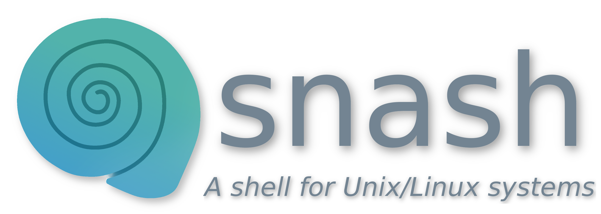

<p align="center">
	
	<!--<h1 align="center">snash</h1>
	<p align="center">A shell for Unix/Linux systems</p>-->
</p>
<p align="center">
	<a href="./LICENSE">
		
	</a>
	<a href="https://github.com/LordOfTrident/snash/issues">
		
	</a>
	<a href="https://github.com/LordOfTrident/snash/pulls">
		
	</a>
	<br><br><br>
</p>

## Table of contents
* [Introduction](#introduction)
* [Quickstart](#quickstart)
* [Features](#features)
* [Bugs](#bugs)
* [Make](#make)

## Introduction
A [shell](https://en.wikipedia.org/wiki/Unix_shell) for [unix](https://en.wikipedia.org/wiki/Unix) and
[linux](https://en.wikipedia.org/wiki/Linux) systems written in Go.
`snash` stands for `snail shell`

## Quickstart
```sh
$ make
$ ./bin/app
```

## Features
- [X] Executing simple commands
- [X] An interactive REPL
- [ ] Environment variables (reading + writing)
- [ ] Aliases
- [ ] If statements
- [ ] Functions
- [ ] Loops

## Bugs
If you find any bugs, please create an issue and report them.

## Make
Run `make all` to see all the make rules.
